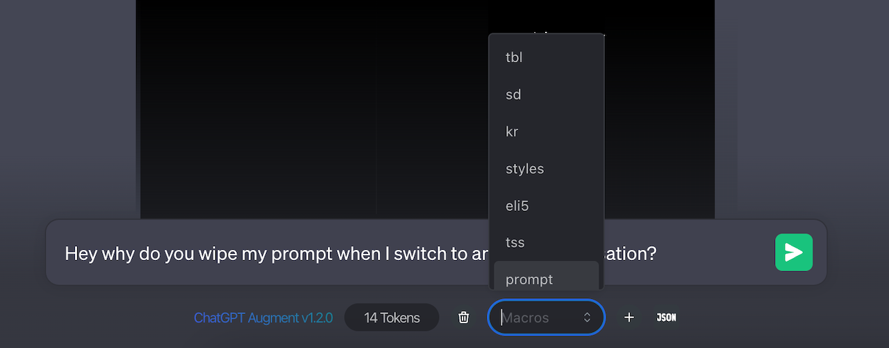
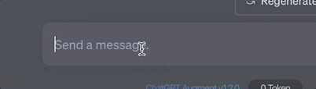
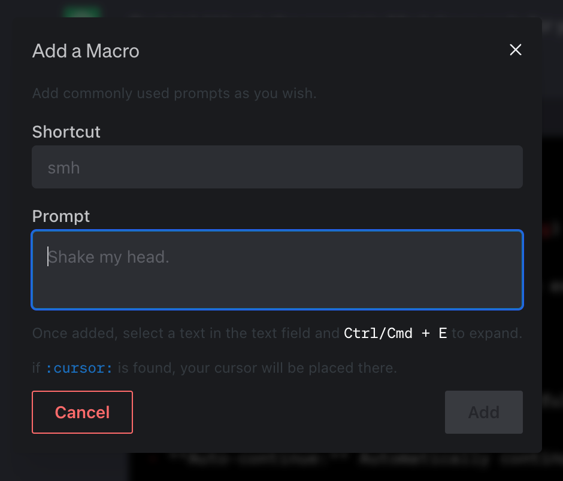
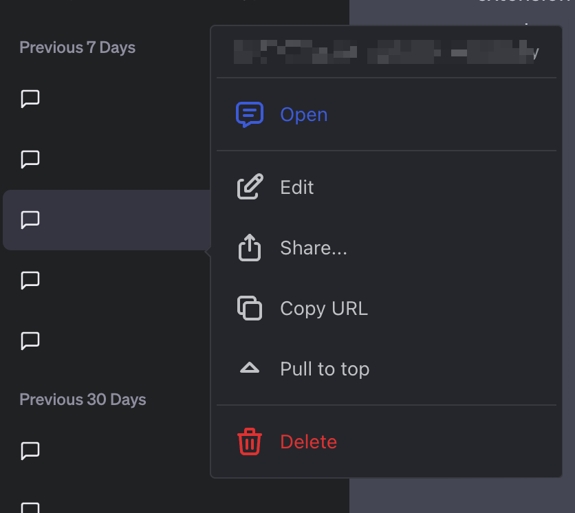
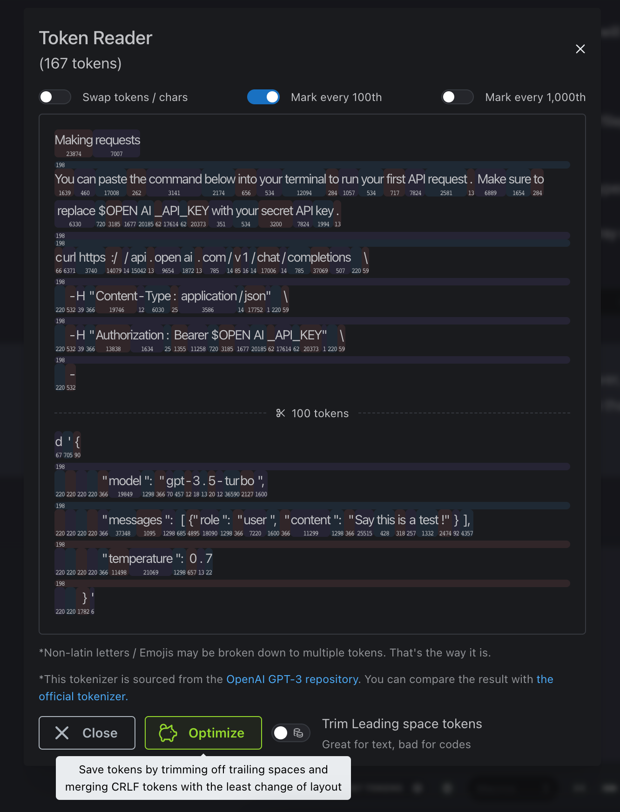

# ChatGPT-Augment Chrome Extension

**TL;DR:**

ChatGPT-Augment is a Chrome extension that enhances your ChatGPT experience by adding useful features.

Install the extension by 1. [Download from the Chrome Web Store](https://chrome.google.com/webstore/detail/chatgpt-augment/kgellgcbfceooklmfjcbofaldbacgpbm) or 2. downloading the latest version from the [Releases](https://github.com/zenyr/chatgpt-augment/releases) page and following the installation steps. The extension is built using React, Vite, Mantine, and ChatGPT. Feedback and support can be provided through email or by submitting issues/PRs on GitHub. The project is licensed under the WTFPL License.

---

# Intro

Welcome to **ChatGPT-Augment**! This Chrome extension enhances your chat experience by adding several useful features. With ChatGPT-Augment, you can auto-continue conversations, use macros to expand shorthand, count tokens in real-time, restore prompts, clear prompts with a single click, scroll over gradients, and even format JSON easily.

Yes, you guessed it. This Readme is also written by ChatGPT.

# Screenshots

| Image                                  | Description                                                                                           |
| -------------------------------------- | ----------------------------------------------------------------------------------------------------- |
|      | - Select a shorthand and press `Ctrl/Cmd+E`.   - use `:cursor:` to designate the cursor position. |
|  | Add/Overwrite/Delete macros here.                                                                     |
|                   | Right click on conversations.                                                                         |
|               | Get precise token counts locally.                                                                     |

# Features

ChatGPT-Augment offers a range of powerful features to enhance your chat experience:

- **Auto-continue:** Automatically continues conversations by clicking continue button after 5 seconds.

- **Macro feature:** Empowers you with the ability to use macros for shorthand expansion. Press <key>Ctrl/Cmd+E</key> while selecting a text. Feature includes:

  - **Text expander:** Expands shorthand to full text, saving you time and effort in typing commonly used phrases or expressions.

  - **Time macro:** Expands words like "now", "next friday" to the current date or time, providing real-time information at your fingertips.

    - Uses `chrono-node` under the hood

  - **Emoji macro:** Expands shorthand like ":coffee:" to the corresponding ☕️ emoji, making your chat interactions more expressive.

    - Uses `node-emoji` under the hood

- **Real-time token count:** Shows the approximate number of tokens in your messages in real-time, giving you a better understanding of your text length as you compose your chat.

  - Uses `gpt-tokenizer` under the hood

- **Prompt restoration:** Restores prompts when jumping over conversations, ensuring you don't lose context.

  - **One-click prompt clear:** Allows you to clear prompts with a single click.

- **Extended scroll area:** Enhances the scrolling experience by making a gradient area click-through, resulting less frustrating behaviors.

- **Integrated JSON formatter:** As a small bonus, ChatGPT-Augment includes a built-in JSON formatter, enabling you to easily format and visualize JSON data within the chat interface.

These features collectively elevate your chat interactions, saving you time, improving readability, and enhancing overall productivity.

# Installation

Because of me being a lazy butt, you got to install this extension on your own. (Also I do not want to add another one-off garbage to the Chrome Extension Store)

To install ChatGPT-Augment on your Chrome browser, follow these steps:

1. Download the latest version of the extension from the [Releases](https://github.com/zenyr/chatgpt-augment/releases) page. Choose the file with the format `extension.zip`.

2. Unzip the downloaded file to extract its contents to your preferred folder.

3. Open the Chrome browser and navigate to `chrome://extensions`.

4. Enable the "Developer mode" toggle switch at the top right corner of the page.

5. Click on the "Load unpacked" button.

6. In the file picker dialog, browse to the location where you extracted the contents of the zip file, and select the root folder.

7. Click "Open" to install the extension.

8. Congratulations! ChatGPT-Augment is now installed on your Chrome browser.

## Usage

Once ChatGPT-Augment is installed, you can start using its features right away. Simply refresh ChatGPT webapp in Chrome, and the extension will automatically enhance your experience at the bottom of your input area.

## Technologies Used

ChatGPT-Augment is built using the following technologies:

- React ⚛
- Vite
  - ergo, Rollup
- Mantine
  - ergo, @tabler/icons-react
- ChatGPT :wink: :wink:

## Feedback and Support

If you encounter any issues, have suggestions for improvements, or want to provide feedback, please feel free to send me an email or submit an issue/PR.

## License

This project is licensed under the WTFPL License.
